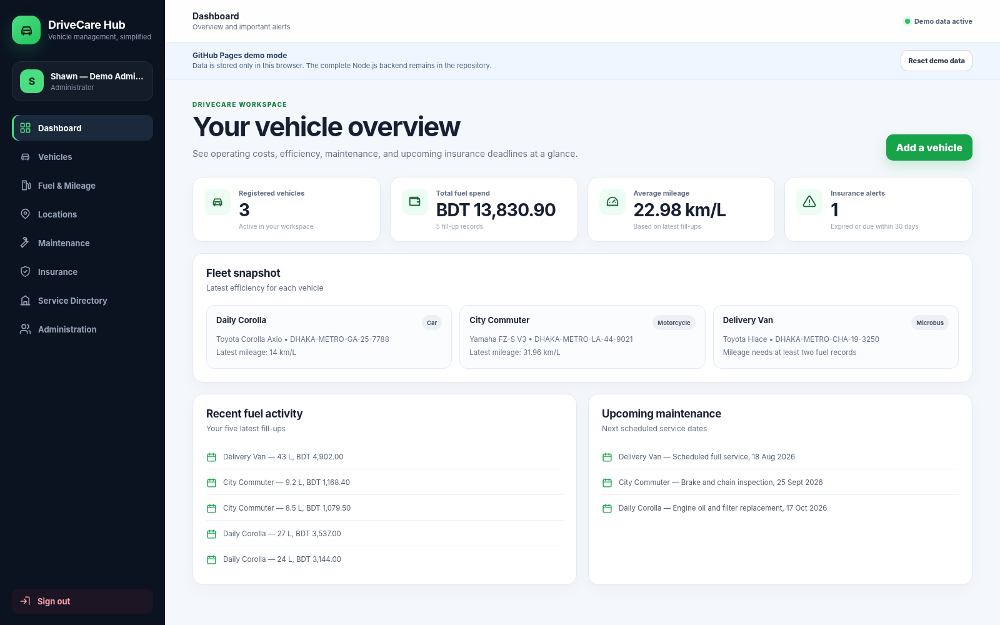
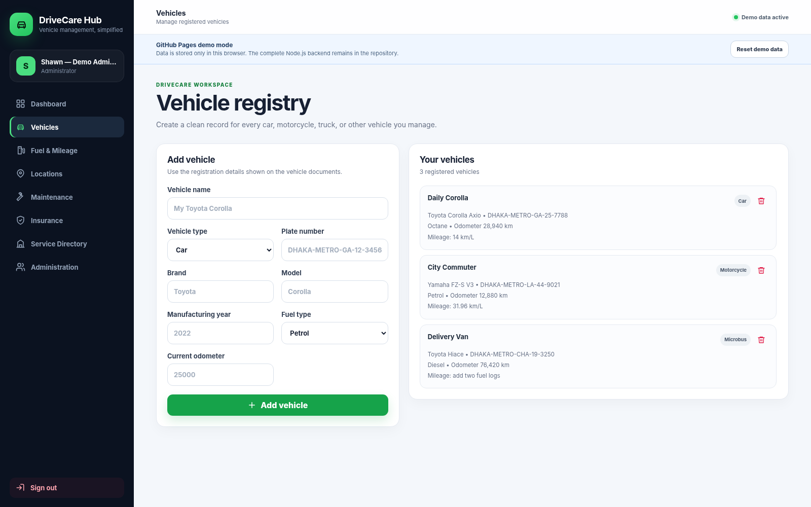
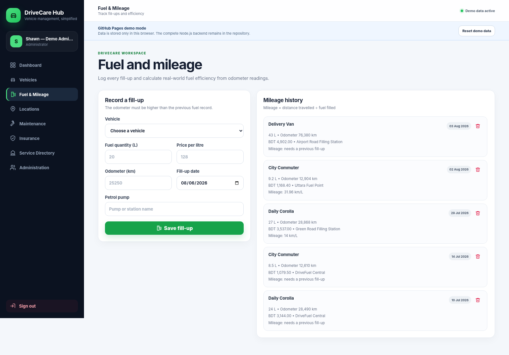

# DriveCare Hub

**A complete vehicle, fuel, mileage, maintenance, insurance, location, and service-directory management platform.**

[](https://nodejs.org/)
[](https://developer.mozilla.org/docs/Web/JavaScript)
[](#quality-assurance)
[](LICENSE)

## Live demo

**GitHub Pages:** [https://shawn-cse.github.io/drivecare-hub/](https://shawn-cse.github.io/drivecare-hub/)

The GitHub Pages website runs in **browser demo mode**. It opens with realistic sample data and stores demo changes in the visitor's browser using `localStorage`.

The complete secure Node.js backend is also included in this repository, but GitHub Pages publishes only the static frontend from the `client/` directory.

### Demo account

```text
Email: admin@drivecare.app
Password: admin123
```

The Pages demo automatically opens the sample administrator workspace. Use **Reset demo data** to restore the original sample records.

## Screenshots

### Dashboard



### Vehicle management



### Fuel and mileage



## Project overview

DriveCare Hub provides one organised workspace for vehicle owners, drivers, petrol pump owners, garage owners, and administrators. It can manage vehicles, fuel costs, mileage, maintenance history, insurance policies, saved locations, petrol pumps, garages, users, and operational alerts.

The repository contains two operating modes:

| Mode | Purpose | Data storage |
|---|---|---|
| GitHub Pages demo | Free public frontend demonstration | Visitor browser `localStorage` |
| Full-stack application | Local use or deployment to a Node.js hosting platform | Atomic JSON database file |

## Main features

| Module | Capabilities |
|---|---|
| Authentication | Registration, login, logout, password hashing, token sessions, role selection, and login rate limiting |
| Dashboard | Vehicle totals, fuel spending, average mileage, insurance alerts, recent activity, and service reminders |
| Vehicle Registry | Add and delete cars, motorcycles, trucks, buses, microbuses, and other vehicles |
| Fuel & Mileage | Record fill-ups, validate odometer progression, calculate cost, and calculate mileage |
| Saved Locations | Capture browser geolocation snapshots with accuracy and Google Maps links |
| Maintenance | Store garage, service type, date, cost, notes, next-service date, and overdue information |
| Insurance | Store providers, policy numbers, premiums, expiry dates, and deadline alerts |
| Service Directory | Manage petrol pump and garage listings with phone numbers, prices, and map coordinates |
| Administration | Review platform totals and safe user metadata without exposing passwords |
| Data Integrity | Deleting a vehicle also removes its related fuel, service, insurance, and location records |

## Supported roles

| Role | Access |
|---|---|
| Vehicle Owner | Personal vehicles and related records |
| Driver | Personal workspace and vehicle records |
| Petrol Pump Owner | Vehicle tools and petrol pump directory listings |
| Garage Owner | Vehicle tools and garage directory listings |
| Administrator | Platform-wide records, statistics, and registered users |

## Technology stack

### Frontend

- Semantic HTML5
- Modern responsive CSS3
- Modular JavaScript ES modules
- Browser Geolocation API
- Fetch API
- Browser `localStorage` demo adapter
- Inline SVG icon system
- No frontend runtime dependencies

### Backend

- Node.js 20.11+
- Native Node.js HTTP server
- PBKDF2-SHA512 password hashing
- Cryptographically secure session tokens
- Role-based access control
- Server-side input validation
- Atomic JSON persistence
- Security and content-policy headers
- No third-party runtime dependencies

## Repository structure

```text
drivecare-hub/
├── .github/
│   └── workflows/
│       └── deploy-pages.yml       # Publishes only client/ to GitHub Pages
├── client/
│   ├── .nojekyll
│   ├── assets/
│   │   ├── favicon.svg
│   │   └── styles.css
│   ├── src/
│   │   ├── views/
│   │   │   ├── admin.js
│   │   │   ├── auth.js
│   │   │   ├── dashboard.js
│   │   │   ├── directory.js
│   │   │   ├── fuel.js
│   │   │   ├── insurance.js
│   │   │   ├── service.js
│   │   │   ├── tracking.js
│   │   │   └── vehicles.js
│   │   ├── api.js                 # Selects backend API or browser demo adapter
│   │   ├── components.js
│   │   ├── constants.js
│   │   ├── demo-data.js           # GitHub Pages sample database
│   │   ├── icons.js
│   │   ├── main.js
│   │   └── utils.js
│   └── index.html
├── docs/
│   ├── ARCHITECTURE.md
│   ├── AUDIT_REPORT.md
│   └── GITHUB_PAGES.md
├── screenshots/
│   ├── s1.png
│   ├── s2.png
│   └── s3.png
├── scripts/
│   └── lint.mjs
├── server/
│   ├── data/
│   │   └── .gitkeep
│   ├── lib/
│   │   ├── auth.mjs
│   │   ├── database.mjs
│   │   └── http.mjs
│   └── index.mjs
├── tests/
│   ├── demo.test.mjs
│   ├── render.test.mjs
│   ├── security.test.mjs
│   └── server.test.mjs
├── .env.example
├── .gitignore
├── CHANGELOG.md
├── LICENSE
├── package-lock.json
├── package.json
└── README.md
```

## Run the complete full-stack application

### 1. Clone the repository

```bash
git clone https://github.com/shawn-cse/drivecare-hub.git
cd drivecare-hub
```

### 2. Confirm Node.js

```bash
node --version
```

Use Node.js **20.11 or newer**.

### 3. Install and verify

The project has no third-party runtime dependencies. Running `npm install` verifies the package lock.

```bash
npm install
npm run check
```

### 4. Start development mode

```bash
npm run dev
```

Open:

```text
http://localhost:4000
```

### 5. Start without watch mode

```bash
npm start
```

## GitHub Pages deployment

The included workflow publishes only the contents of `client/`:

```text
.github/workflows/deploy-pages.yml
```

After uploading the project to GitHub:

1. Open the repository.
2. Go to **Settings → Pages**.
3. Under **Build and deployment**, choose **GitHub Actions**.
4. Open the **Actions** tab and allow the deployment workflow to finish.
5. Visit `https://shawn-cse.github.io/drivecare-hub/`.

The workflow does not upload `server/`, tests, documentation, or private runtime data to the Pages website. Those files remain visible only as repository source code.

More details are available in [docs/GITHUB_PAGES.md](docs/GITHUB_PAGES.md).

## Environment variables

| Variable | Default | Description |
|---|---:|---|
| `PORT` | `4000` | HTTP server port |
| `APP_ORIGIN` | `http://localhost:5173` | Optional additional allowed development origin |
| `SESSION_TTL_HOURS` | `24` | Session-token lifetime |
| `DATABASE_FILE` | `server/data/database.json` | Custom JSON database path |

Linux/macOS example:

```bash
PORT=5000 SESSION_TTL_HOURS=12 npm start
```

Windows PowerShell example:

```powershell
$env:PORT=5000
$env:SESSION_TTL_HOURS=12
npm start
```

## Available scripts

| Command | Purpose |
|---|---|
| `npm run dev` | Start the backend with Node.js watch mode |
| `npm start` | Start the production server |
| `npm run lint` | Syntax-check frontend, backend, tests, and scripts |
| `npm test` | Run automated tests |
| `npm run check` | Run all syntax checks and tests |

## API summary

### Public routes

| Method | Route | Purpose |
|---|---|---|
| `GET` | `/api/health` | Service health check |
| `POST` | `/api/auth/register` | Create an account |
| `POST` | `/api/auth/login` | Sign in |

### Authenticated routes

| Method | Route | Purpose |
|---|---|---|
| `GET` | `/api/auth/session` | Restore the current session and workspace data |
| `POST` | `/api/auth/logout` | End the current session |
| `GET` | `/api/data` | Retrieve role-filtered application data |
| `POST` | `/api/vehicles` | Add a vehicle |
| `POST` | `/api/fuelLogs` | Add a fuel record |
| `POST` | `/api/serviceRecords` | Add a maintenance record |
| `POST` | `/api/insuranceRecords` | Add an insurance policy |
| `POST` | `/api/locations` | Save a location snapshot |
| `POST` | `/api/pumps` | Add a petrol pump listing |
| `POST` | `/api/garages` | Add a garage listing |
| `DELETE` | `/api/:collection/:id` | Delete an authorised record |

## Mileage calculation

```text
Distance travelled = Current odometer - Previous odometer
Mileage = Distance travelled / Current fuel quantity
```

At least two fuel records are required for a vehicle before mileage can be calculated.

## Security improvements

- Passwords are hashed with PBKDF2-SHA512 and unique random salts.
- Plaintext passwords are not stored in the browser or returned by the backend API.
- Sessions use random 256-bit bearer tokens with expiry times.
- Private API routes reject unauthenticated requests.
- Non-administrator users receive only authorised records.
- Login attempts are rate limited by IP address.
- Request bodies have a maximum size.
- Inputs are trimmed, length-limited, type-checked, and validated.
- User-provided content is escaped before frontend rendering.
- Security headers include CSP, `X-Content-Type-Options`, `X-Frame-Options`, and `Referrer-Policy`.
- Database writes use a temporary file and atomic rename.
- Mutating backend requests are serialised to reduce conflicting writes.

> The browser-only Pages demo is intentionally a public demonstration. Do not store sensitive or real user data in that mode.

## Quality assurance

Current verification result:

```text
Source files checked: 20
Automated tests passed: 7
Automated tests failed: 0
Demo adapter CRUD test: included
```

Tests cover:

- Static frontend delivery
- Frontend view rendering
- Administrator authentication
- Password hashing
- HTML escaping
- Vehicle creation
- Fuel-cost calculation
- Odometer validation
- User registration
- Role filtering
- Cross-user deletion rejection
- Vehicle cascade deletion
- Unauthenticated API rejection

Run verification again with:

```bash
npm run check
```

## Data-storage note

The full-stack application creates:

```text
server/data/database.json
```

This runtime database is ignored by Git. The JSON database is suitable for demonstrations, local use, and one small server instance. For larger production deployments, replace it with PostgreSQL, MySQL, or another managed transactional database.

## Author

**Shawn**

- GitHub: [shawn-cse](https://github.com/shawn-cse)
- Email: [shawnazd@gmail.com](mailto:shawnazd@gmail.com)

## License

This project is licensed under the [MIT License](LICENSE).
